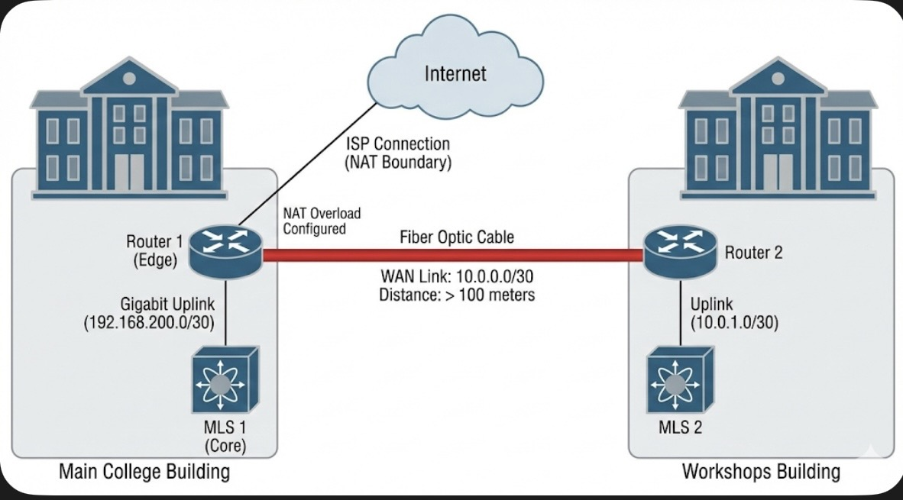
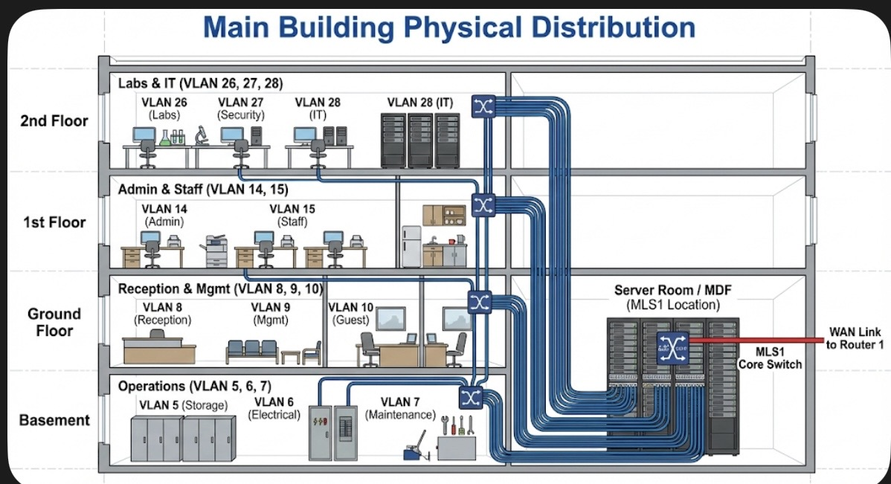
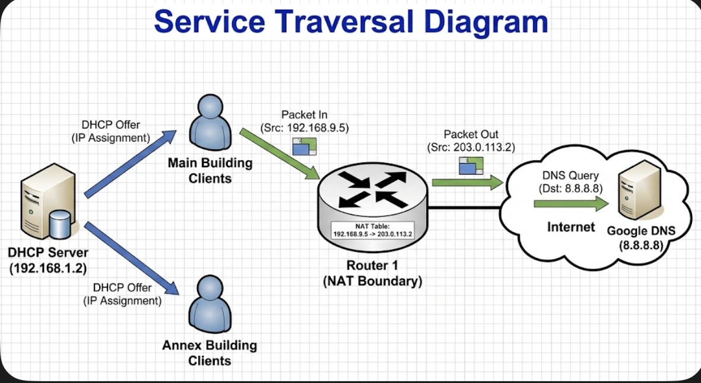
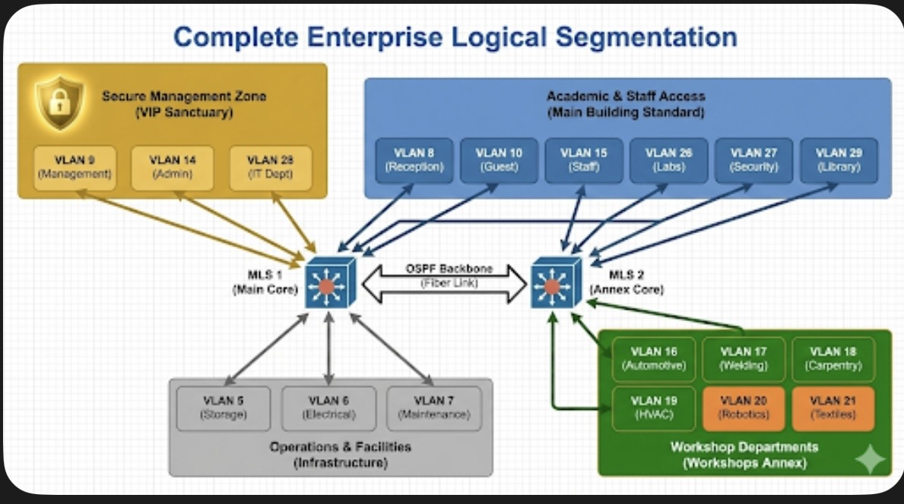
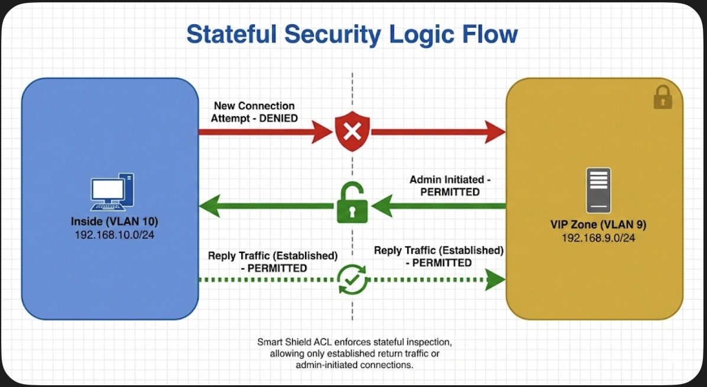
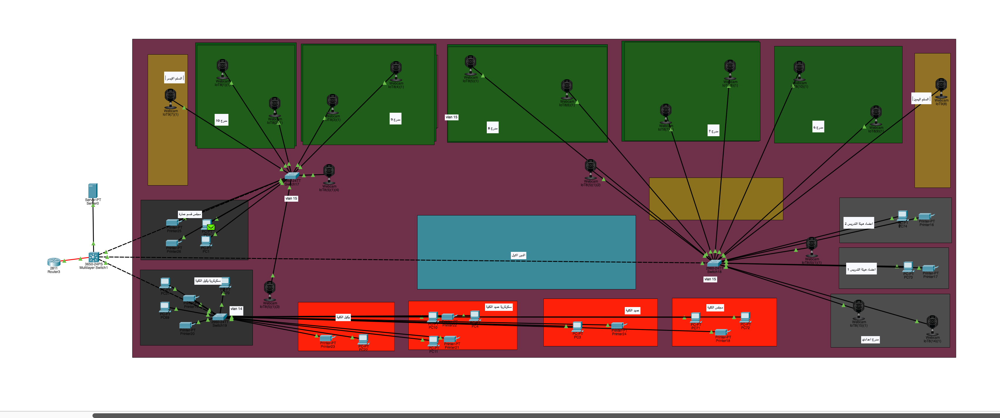
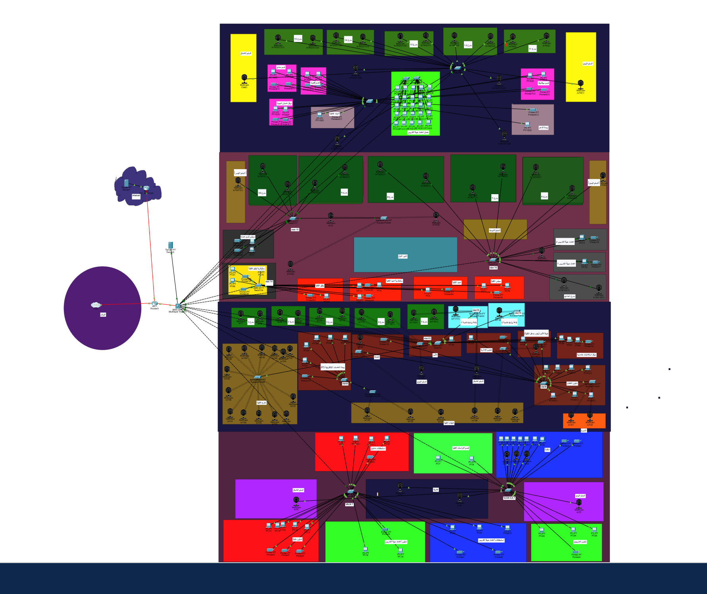
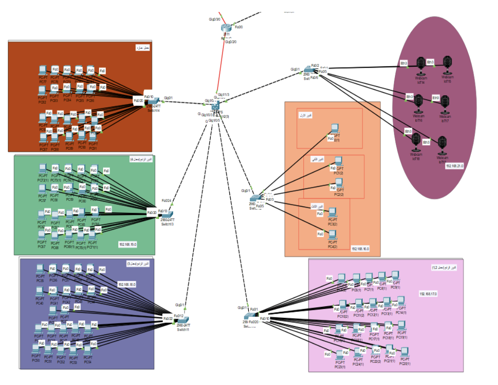

# 🌐 Enterprise Multi-Building Campus Network

A Cisco Packet Tracer simulation of a secure, scalable enterprise campus network using OSPF, VLAN segmentation, centralized services, and stateful access control.


---

## 📌 Project Overview
This project simulates a **scalable, high-availability enterprise campus network** spanning two physical locations:

- **Main College Building**
- **Workshops / Annex Building**

The design emphasizes:
- Logical segmentation using VLANs  
- Secure access control for VIP and management networks  
- Dynamic routing with fast convergence  
- Reliable inter-building connectivity using fiber-optic links  

Designed and implemented by **Hazem Yasser Mahmoud Mohamed**.

---
## 🎯 Design Goals
- Scalable VLAN architecture for multi-floor buildings
- Secure isolation of VIP and management networks
- High-speed inter-building connectivity
- Centralized control of routing, DHCP, and Internet access
- Realistic enterprise-style security policies
---
## 🏗️ Network Topology
The network follows the **Hierarchical Network Model (Core / Distribution / Access)** to ensure performance, scalability, and fault tolerance.

### 🏢 Main Building (4 Floors)

- **Basement (Infrastructure):**
  - Storage, Electrical, Maintenance  
  - VLANs: `5`, `6`, `7`

- **Ground Floor (Public & Management):**
  - Reception, **VIP Management**, Security  
  - VLANs: `8`, **`9`**, `10`

- **First Floor (Administration):**
  - **VIP Admin**, Staff Offices  
  - VLANs: **`14`**, `15`

- **Second Floor (Technical):**
  - Labs A & B, **VIP IT Department**  
  - VLANs: `26`, `27`, **`28`**

---

### 🏭 Workshops / Annex Building
- Separate VLANs for each workshop department  
- VLAN range: `16–21`
- Connected to the main campus via a **high-speed fiber optic WAN link**

📌 **Note:** Refer to the `images/` folder for high-resolution logical and physical topology diagrams.

---
## 🧩 VLAN Allocation Summary

| VLAN ID | Department / Purpose       | Location          |
|-------|----------------------------|------------------|
| 5–7   | Infrastructure Services    | Basement         |
| 8     | Reception                  | Ground Floor     |
| 9     | VIP Management             | Ground Floor     |
| 10    | Security                   | Ground Floor     |
| 14    | VIP Administration         | First Floor      |
| 15    | Staff Offices              | First Floor      |
| 16–21 | Workshop Departments       | Annex Building   |
| 26–27 | Technical Labs             | Second Floor     |
| 28    | VIP IT Department          | Second Floor     |

---
## 🚀 Key Features

### 1️⃣ Dynamic Routing – **OSPF**
- **OSPF Area 0** implemented across routers and multilayer switches  
- Fast convergence and automatic route updates  
- Point-to-point fiber links using `/30` subnets (e.g., `10.0.0.0/30`) for efficiency  

---

### 2️⃣ "Smart Shield" Security – **Stateful ACLs**
**Objective:**  
Protect sensitive **VIP VLANs (`9`, `14`, `28`)** from unauthorized internal access while maintaining operational flexibility.

**Security Logic:**
- ❌ Block **new connection attempts** from Students & Workshop VLANs to VIP VLANs  
- ✅ Allow VIPs to **initiate connections freely**
- ✅ Permit **return traffic** using TCP `established` flag
- ✅ Allow critical infrastructure services (DNS/DHCP)

---

### 3️⃣ Services & Internet Edge
- **NAT Overload (PAT):**  
  Allows all internal private IPs to share a single public ISP address
- **Centralized DHCP Server:**  
  IP: `192.168.1.2`  
  Serves dynamic addresses for **15+ VLANs**
- **DNS Forwarding:**  
  Uses Google Public DNS (`8.8.8.8`) for external resolution

---
### 4️⃣ Secure Remote Management (SSH)
Secure Shell (SSH) has been configured on the **4 core network devices** (Routers & Multilayer Switches) to enable encrypted remote management, replacing insecure Telnet connections.

**Credentials for Access:**
| Parameter | Value |
| :--- | :--- |
| **Protocol** | SSH v2 |
| **Password** | `AdminPass123` |

---


## 🛠️ Configuration Highlights

### 🔐 Smart Shield – Extended ACL
*Configured on MLS1 (Core Multilayer Switch)*

```bash
ip access-list extended SECURE_VIPS
 ! 1. Allow Infrastructure Server (DNS/DHCP)
 permit ip host 192.168.1.2 any

 ! 2. Allow established TCP sessions (VIP-initiated traffic)
 permit tcp 192.168.0.0 0.0.255.255 any established

 ! 3. Allow ICMP echo-replies (return ping traffic)
 permit icmp 192.168.0.0 0.0.255.255 any echo-reply

 ! 4. Block new unauthorized internal access
 deny ip 192.168.0.0 0.0.255.255 any

 ! 5. Permit Internet-bound traffic
 permit ip any any
```

⸻

### 📡 OSPF Configuration

Configured on Edge Router (Router 1)
```bash
router ospf 1
 ! WAN link to Workshop Building
 network 10.0.0.0 0.0.0.3 area 0

 ! Uplink to Main Building Core
 network 192.168.200.0 0.0.0.3 area 0

 ! Advertise default route (Internet access)
 default-information originate
```

⸻

## 📸 Screenshots & Diagrams










⸻

### 📦 How to Run the Project
```txt
1.	Download
•	Clone this repository or download the .pkt file
2.	Launch
•	Open Cisco Packet Tracer (v8.0 or newer)
3.	Load
•	File → Open → Campus_Network_Project.pkt
4.	Test Connectivity
•	❌ Ping from VLAN 10 → VLAN 9 (Blocked)
•	✅ Ping from VLAN 9 → 8.8.8.8 (Allowed)
```

⸻

## 👤 Author

- ***Hazem Yasser Mahmoud Mohamed***
- ***Electronics & Communications Engineering Student***
- ***Suez Canal University***
- ***Student ID: 211600109***


